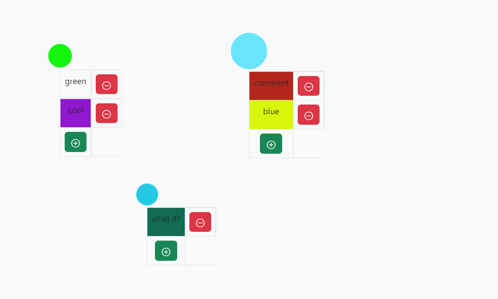
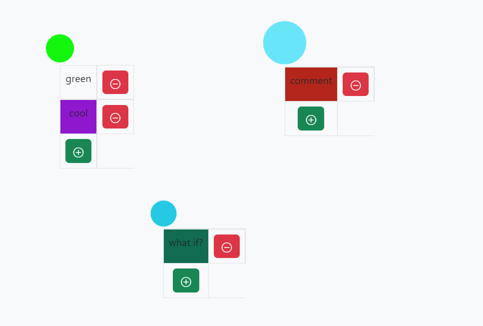
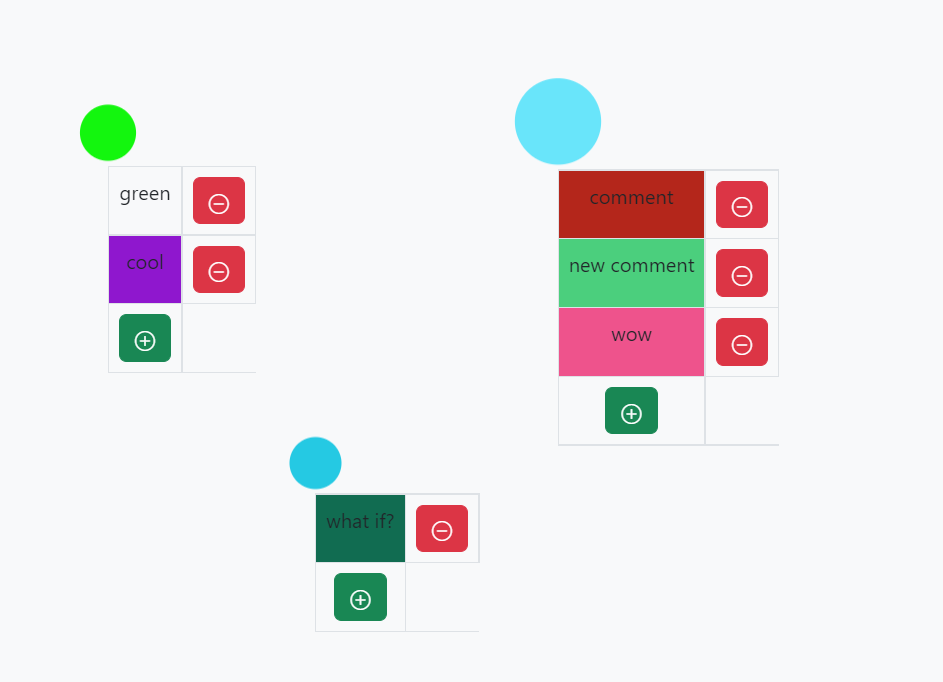
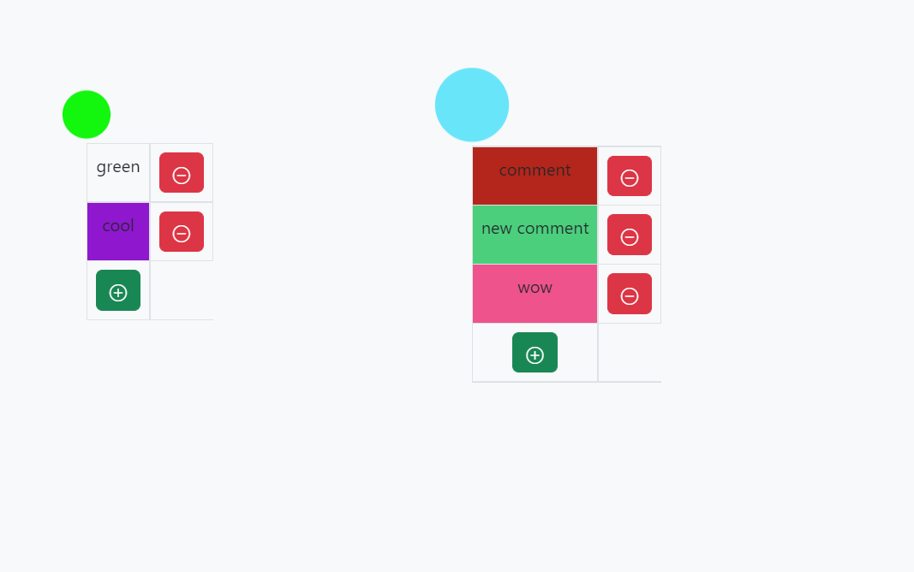

<h1>Point comments</h1>
<h3> A simple app with the ability to add and remove new points, add and remove comments to them </h3>
 

<h1>Stack</h1>
Backend
<ul>
    <li>.NET 5 - Web API</li>
    <li>Entity Framework Core - In-Memory, code-first database</li>
    <li>MediatR - CQRS pattern</li>
    <li>Fluent Validation - model validation</li>
</ul>
Frontend
<ul>
    <li>Typescript - Client app</li>
    <li>AJAX - HTTP requests</li>
    <li>Konva.js - drawing</li>
    <li>Bootstrap - tables and style sheets</li>
</ul>

<h1>Demo</h1>
<h3>Points with comments (one click to add a new point)</h3>

<h3>Remove comment</h3>

<h3>Add new comments</h3>

<h3>Remove the point (double click)</h3>

